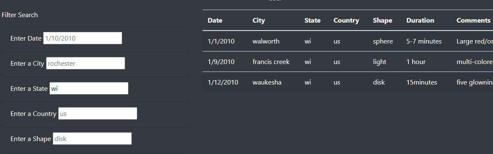
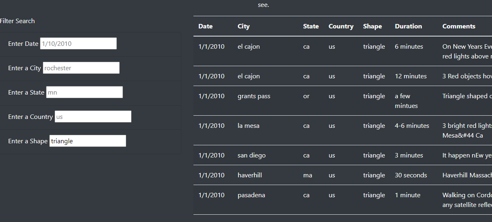
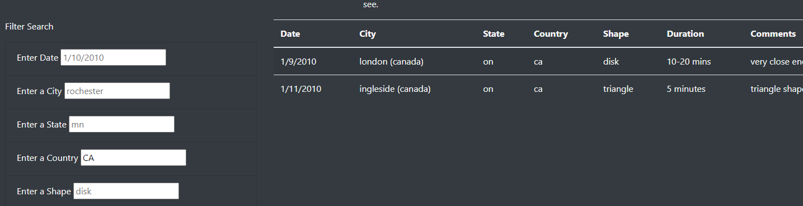

# UFOs
## Purpose
Provide users access to UFO sighting data and the ability to do a more in-depth analysis of UFO sightings by allowing them to filter for multiple criteria at the same time. In addition to the date, a user can filter for the city, state, country, and shape.

## Results
A user can search through the UFO database by filtering on different values of the data. For someone to reset the database all they need to do is delete the filters that they input.

See screen shots below for the usage of this webpage:

If someone only wants to list UFO sightings on a certain date, they can enter the date into the date box in the format mm/dd/yyyy

If someone only wants to list UFO sightings in a certain city, they can enter the full name of the city into the city filter box as shown

If someone only wants to list UFO sightings in a certain state, they can enter the two-digit state code into the state filter box as shown

If someone only wants to list UFO sightings in a certain country, they can enter in the two-digit country code into the country filter box as shown

If someone only wants to list UFO sightings with a certain shape, they can enter the name of the shape into the shape filter box as shown

A person might decide that entering in only one filter brings back too many results so they can enter in multiple filters to continue to drill down into the data the screenshot below is an example.

## Summary
In summary this webpage makes it possible for users to investigate the UFO data on their own using multiple filters. However, one drawback is the way the user must enter the data. I already made it so that they don’t have to enter only lower-case values, It would be nice to have more options than just upper and lower case, like the ability to use full country names and state names. Or instead of the user entering in values for country, state and shape the user could just select from a drop-down menu instead. This way the user doesn’t have to know what is and is not a value that will work. It would also be nice to accept multiple date formats for those that might be used to dd/mm/yy formats.
